# terraform-azure-monitor

Production-ready Terraform module for deploying Azure Monitor with action groups, metric alerts, log alerts, activity log alerts, diagnostic settings, Application Insights, Log Analytics workspace, and data collection rules.

## Architecture

```mermaid
flowchart TB
    subgraph Workspace["Log Analytics"]
        LA[Log Analytics Workspace]
        SOL1[Security Insights]
        SOL2[Container Insights]
    end

    subgraph AppInsights["Application Insights"]
        AI[Application Insights]
    end

    subgraph Alerts["Alert Rules"]
        MA1[Metric Alert - CPU]
        MA2[Metric Alert - Storage]
        LGA[Log Alert - KV Errors]
        ALA1[Activity Log - Service Health]
        ALA2[Activity Log - Resource Health]
        ALA3[Activity Log - Policy Changes]
    end

    subgraph Actions["Action Groups"]
        AG1[Critical - Email + SMS + Webhook]
        AG2[Warning - Email]
        AG3[Informational - Email]
    end

    subgraph Diagnostics["Diagnostic Settings"]
        DS1[Key Vault Diagnostics]
        DS2[Storage Diagnostics]
    end

    subgraph DCR["Data Collection"]
        DCR1[Linux Perf Counters]
        DCR2[Syslog Collection]
    end

    subgraph Targets["Monitored Resources"]
        KV[Key Vault]
        SA[Storage Account]
        VM[Virtual Machines]
    end

    AI --> LA
    SOL1 --> LA
    SOL2 --> LA
    MA1 --> AG1
    MA2 --> AG2
    LGA --> AG1
    ALA1 --> AG1
    ALA2 --> AG2
    ALA3 --> AG3
    DS1 --> LA
    DS2 --> LA
    DS1 --> KV
    DS2 --> SA
    DCR1 --> LA
    DCR2 --> LA
    MA1 --> VM
    MA2 --> SA
    LGA --> KV

    style LA fill:#0078D4,stroke:#005A9E,color:#fff
    style SOL1 fill:#0078D4,stroke:#005A9E,color:#fff
    style SOL2 fill:#0078D4,stroke:#005A9E,color:#fff
    style AI fill:#8C4FFF,stroke:#6B3AC2,color:#fff
    style MA1 fill:#DD344C,stroke:#B02A3E,color:#fff
    style MA2 fill:#DD344C,stroke:#B02A3E,color:#fff
    style LGA fill:#DD344C,stroke:#B02A3E,color:#fff
    style ALA1 fill:#DD344C,stroke:#B02A3E,color:#fff
    style ALA2 fill:#DD344C,stroke:#B02A3E,color:#fff
    style ALA3 fill:#DD344C,stroke:#B02A3E,color:#fff
    style AG1 fill:#FF9900,stroke:#CC7A00,color:#fff
    style AG2 fill:#FF9900,stroke:#CC7A00,color:#fff
    style AG3 fill:#FF9900,stroke:#CC7A00,color:#fff
    style DS1 fill:#3F8624,stroke:#2D6119,color:#fff
    style DS2 fill:#3F8624,stroke:#2D6119,color:#fff
    style DCR1 fill:#3F8624,stroke:#2D6119,color:#fff
    style DCR2 fill:#3F8624,stroke:#2D6119,color:#fff
    style KV fill:#0078D4,stroke:#005A9E,color:#fff
    style SA fill:#0078D4,stroke:#005A9E,color:#fff
    style VM fill:#0078D4,stroke:#005A9E,color:#fff
```



## Usage

```hcl
module "monitor" {
  source = "path/to/terraform-azure-monitor"

  resource_group_name          = "rg-monitor"
  location                     = "East US"
  log_analytics_workspace_name = "log-prod-001"

  action_groups = {
    "ag-ops" = {
      short_name = "OpsTeam"
      email_receivers = [{
        name          = "ops"
        email_address = "ops@example.com"
      }]
    }
  }
}
```

## Examples

- [Basic](examples/basic/main.tf) - Log Analytics workspace with action group
- [Advanced](examples/advanced/main.tf) - Metric alerts, Application Insights, and service health alerts
- [Complete](examples/complete/main.tf) - Full monitoring platform with all alert types, diagnostics, and data collection rules

## Requirements

| Name | Version |
|------|---------|
| [terraform](https://www.terraform.io/) | >= 1.5.0 |
| [azurerm](https://registry.terraform.io/providers/hashicorp/azurerm/latest/docs) | >= 3.80.0 |

## Resources

| Name | Type | Documentation |
|------|------|---------------|
| [azurerm_log_analytics_workspace](https://registry.terraform.io/providers/hashicorp/azurerm/latest/docs/resources/log_analytics_workspace) | resource | Log Analytics workspace |
| [azurerm_log_analytics_solution](https://registry.terraform.io/providers/hashicorp/azurerm/latest/docs/resources/log_analytics_solution) | resource | Log Analytics solutions |
| [azurerm_application_insights](https://registry.terraform.io/providers/hashicorp/azurerm/latest/docs/resources/application_insights) | resource | Application Insights |
| [azurerm_monitor_action_group](https://registry.terraform.io/providers/hashicorp/azurerm/latest/docs/resources/monitor_action_group) | resource | Action groups |
| [azurerm_monitor_metric_alert](https://registry.terraform.io/providers/hashicorp/azurerm/latest/docs/resources/monitor_metric_alert) | resource | Metric alerts |
| [azurerm_monitor_scheduled_query_rules_alert_v2](https://registry.terraform.io/providers/hashicorp/azurerm/latest/docs/resources/monitor_scheduled_query_rules_alert_v2) | resource | Log alerts |
| [azurerm_monitor_activity_log_alert](https://registry.terraform.io/providers/hashicorp/azurerm/latest/docs/resources/monitor_activity_log_alert) | resource | Activity log alerts |
| [azurerm_monitor_diagnostic_setting](https://registry.terraform.io/providers/hashicorp/azurerm/latest/docs/resources/monitor_diagnostic_setting) | resource | Diagnostic settings |
| [azurerm_monitor_data_collection_rule](https://registry.terraform.io/providers/hashicorp/azurerm/latest/docs/resources/monitor_data_collection_rule) | resource | Data collection rules |

## Inputs

| Name | Description | Type | Default | Required |
|------|-------------|------|---------|----------|
| resource_group_name | Name of the resource group | `string` | n/a | yes |
| location | Azure region | `string` | n/a | yes |
| create_log_analytics_workspace | Create Log Analytics workspace | `bool` | `true` | no |
| log_analytics_workspace_name | Workspace name | `string` | `""` | no |
| log_analytics_sku | Workspace SKU | `string` | `"PerGB2018"` | no |
| log_analytics_retention_days | Data retention days | `number` | `30` | no |
| log_analytics_daily_quota_gb | Daily ingestion quota GB | `number` | `-1` | no |
| log_analytics_solutions | Solutions to install | `map(object)` | `{}` | no |
| create_application_insights | Create Application Insights | `bool` | `false` | no |
| application_insights_name | App Insights name | `string` | `""` | no |
| application_insights_type | App Insights type | `string` | `"web"` | no |
| application_insights_retention_days | App Insights retention | `number` | `90` | no |
| action_groups | Action group definitions | `map(object)` | `{}` | no |
| metric_alerts | Metric alert definitions | `map(object)` | `{}` | no |
| log_alerts | Log alert definitions | `map(object)` | `{}` | no |
| activity_log_alerts | Activity log alert definitions | `map(object)` | `{}` | no |
| diagnostic_settings | Diagnostic setting definitions | `map(object)` | `{}` | no |
| data_collection_rules | Data collection rule definitions | `map(object)` | `{}` | no |
| tags | Tags for all resources | `map(string)` | `{}` | no |

## Outputs

| Name | Description |
|------|-------------|
| log_analytics_workspace_id | Resource ID of Log Analytics workspace |
| log_analytics_workspace_name | Name of Log Analytics workspace |
| log_analytics_workspace_customer_id | Workspace (customer) ID |
| log_analytics_workspace_primary_shared_key | Primary shared key (sensitive) |
| application_insights_id | Resource ID of Application Insights |
| application_insights_name | Name of Application Insights |
| application_insights_app_id | Application ID |
| application_insights_instrumentation_key | Instrumentation key (sensitive) |
| application_insights_connection_string | Connection string (sensitive) |
| action_group_ids | Map of action group names to resource IDs |
| metric_alert_ids | Map of metric alert names to resource IDs |
| log_alert_ids | Map of log alert names to resource IDs |
| activity_log_alert_ids | Map of activity log alert names to resource IDs |
| diagnostic_setting_ids | Map of diagnostic setting names to resource IDs |
| data_collection_rule_ids | Map of DCR names to resource IDs |

## License

MIT License - see [LICENSE](LICENSE) for details.
